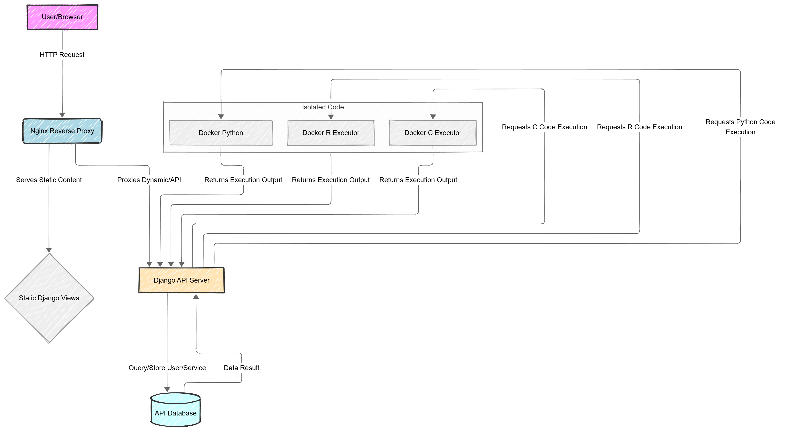

# Broncode

## Introduction
Broncode is an interactive coding tutorial platform created by Josh Chandler, Charles Noble, Ahmed Radwan, and Alexander Wardell for use by the Western Michigan University College of Engineering and Applied Sciences, commisioned by Dr. John Kapenga.

## Usage
Usage of Broncode requires an Nginx server as well as Django, Docker and Postgres. Installation and usage instructions can be found in the manual found in the docs folder.

## Architecture

## Demo

